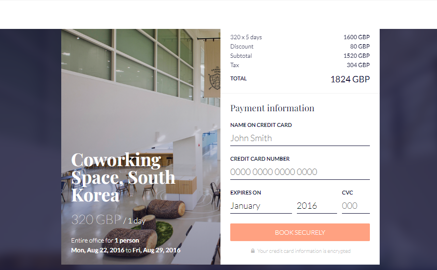

# Checkout Form

This is a checkout form built with React, Redux, and redux-form, and styled using
CSS modules. It is my recreation of challenge 002 of the
[React Daily UI challenge](https://github.com/fullstackreact/react-daily-ui) by
Fullstack React.

|               Mobile 1               |               Mobile 2               |           Desktop            |                  Original (Fullstack React)                   |
| :----------------------------------: | :----------------------------------: | :--------------------------: | :-----------------------------------------------------------: |
|  |  | Desktop view being completed |  |

## Developer Setup

Clone the repo and cd into the newly-created `002-checkout` folder:

```
git clone https://github.com/CodeWithOz/002-checkout.git
cd 002-checkout/
```

Install dependencies and run the dev server:

```
yarn install
yarn start
```

### Testing

Run `yarn test`.

This project was bootstrapped with
[Create React App](https://github.com/facebook/create-react-app) so
all its cli options are available.
